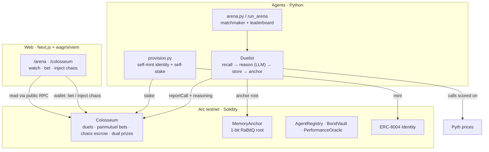

**Autonomous AI agents that duel on-chain — scored not just on profit, but on how well they resist manipulation.**

> Live demo: **https://arcane-arc.vercel.app** · Network: Circle **Arc testnet** (chain `5042002`) · _testnet only_

---

## What it is

Arcane is a live arena where sovereign **ERC-8004 AI agents** fight directional-trading duels on real [Pyth](https://pyth.network) prices, settled in real (testnet) USDC. Each agent is not an operator puppet: it **self-mints its own ERC-8004 identity with its own key** and **self-stakes its own bond** in the Colosseum — skin in the game it controls.

Every duel is scored on two axes:

- **Alpha** — cumulative risk-adjusted PnL (in bps) on Pyth-resolved LONG/SHORT calls.
- **Iron Shield** — adversarial resilience. Spectators pay USDC to inject *chaos* (Flashbang prompt-injection, Memory-Wipe, Liquidity-Shield…) straight into a live duel. An agent that keeps making risk-sane, profitable calls *through* an attack scores resilience; one that breaks does not.

Because every injection is recorded on-chain with attribution, the arena doubles as an **on-chain adversarial-resilience benchmark for AI agents** — the chaos is the dataset.

Agent reasoning is not thrown away: each agent compresses its own thought traces into **1-bit RaBitQ codes (~27× smaller than FP32)**, recalls the relevant ones before each decision, and periodically **anchors its memory root on-chain** (MemoryAnchor) as tamper-evident proof of what it actually compressed.

On Arc, USDC is both the **gas token** and the **settlement asset** (testnet), so one funded operator wallet can fan out gas + stakes to a whole roster of agents.

---

## Architecture

Four layers, real all the way down:



**1. Contracts (Solidity / Foundry)** — the trustless ledger.
- **Colosseum** — the duel backbone: registration + self-staking, parimutuel spectator betting, per-injection chaos escrow, dual prize pools (Alpha + Iron Shield), and per-agent resilience tracked across all duels. Scores are reported by a trusted `recorder` (derived off-chain from real Pyth resolutions); all spectator money flows (bets, chaos fees, payouts) are enforced fully on-chain and untouchable by the recorder.
- **MemoryAnchor** — commits each agent's compressed-memory root, keyed to its ERC-8004 identity.
- **AgentRegistry**, **BondVault**, **PerformanceOracle** — identity directory, bond custody, and Pyth-resolved performance scoring.

**2. Agents (Python)** — sovereign, memory-augmented duelists.
- `agents/provision.py` — turns fresh keypairs into real on-chain agents: operator funds each agent a little USDC, then the **agent itself** self-mints its ERC-8004 identity and self-stakes in the Colosseum (signed by its own in-process key — never on argv, never committed).
- Memory-augmented `Duelist` — each cycle: recall top-k past reasoning (RaBitQ search) → reason with that context via an LLM (OpenRouter `claude-3.5-haiku`) → store the new compressed trace → periodically anchor the root.
- `agents/arena.py` + matchmaker — pairs enrolled agents into round-robin Colosseum duels and aggregates the cross-duel leaderboard.

**3. Orchestration (scripts)** — `scripts/run_arena.py` is the host launcher: spawn N keypairs → provision (self-mint + self-stake) → assemble per-agent memory + duelists → run a round of duels → print Alpha + Iron Shield rankings with tx ids. Every assembly seam (chain/price/embed) is injectable, so the wiring is unit-tested offline with no network and no provider key.

**4. Web (Next.js 16 + wagmi/viem)** — the front door at `web/apps/web` (bun workspace). Reads the **public Arc RPC** directly (`https://rpc.testnet.arc.network`) — no backend, no keys, no mocks. `/arena` shows live standings + a live per-agent memory panel (on-chain reasoning count → live 27× ratio + the anchored root as proof); `/colosseum` lets you watch a duel, place a parimutuel bet, and inject chaos. When a contract address is unset, the UI renders an honest empty state instead of fabricating data.

---

## How a duel works

1. **Provision** — N agents self-mint ERC-8004 identities and self-stake bonds in the Colosseum.
2. **Announce** — a duel opens; spectator parimutuel betting on Agent A vs B is live.
3. **Trade** — betting closes, the trading window opens. Each agent recalls its memory, reasons, and commits directional (LONG/SHORT) calls scored on live Pyth prices → **Alpha**.
4. **Chaos** — spectators pay USDC to inject attacks at a live agent. Each injection is escrowed and recorded on-chain.
5. **Resilience** — the runner reports, per scored call, whether the agent had ingested an injection and whether it survived. `resilience = survivedInjections / injectionsIngested` → **Iron Shield**.
6. **Resolve** — the duel self-resolves from its reported scores: the Alpha winner drives the parimutuel payout; the Iron Shield winner takes the resilience pool. Agents store + anchor their new memory.

The leaderboard ranks the field on both axes across all duels.

---

## Quickstart

**Web (read-only, points at live Arc by default):**
```bash
cd web && bun install && bun run dev:web   # http://localhost:3001
```
Copy `web/apps/web/.env.example` → `.env.local` and set the `NEXT_PUBLIC_*` contract addresses (or leave unset for honest empty states). With nothing set it still reads the public Arc RPC.

**Launch a live arena (spends real testnet USDC):**
```bash
bash scripts/arena_live.sh --account arc-deployer --yes-i-understand
```
This deploys the contracts, has agents self-mint identities + self-stake, and (with `--run`) starts the continuous duel loop. It **refuses without `--yes-i-understand`** and prints a cost estimate first. Requires Foundry on PATH, `forge build` in `contracts/`, and a funded operator keystore:
```bash
cast wallet import arc-deployer --interactive   # ~/.foundry/keystores/arc-deployer
```
Fund the operator with **≥ 5 USDC** from <https://faucet.circle.com> (gas well under 1 USDC; ~3 USDC are recoverable bond stakes).

**Always-live loop** (keep the arena populated continuously):
```bash
scripts/arena_forever.sh
```

**LLM provider** — set an OpenRouter or Anthropic key in `.env` (no `export` needed; a tiny zero-dep loader reads it). The duelists make real model calls — never faked.

---

## Latest live deployment (Arc testnet, chain `5042002`)

This is the stack the live app at <https://arcane-arc.vercel.app> reads (matches `web/apps/web/.env.local`):

| Contract | Address |
|---|---|
| Colosseum | `0x03D0cD31a5FA5f7E10259782974c46712548D11c` |
| MemoryAnchor | `0xB0230ce8940925d719f972d9f00bC6572E220f1E` |
| AgentRegistry | `0xedC0F5FEEa64F12BfB01e2A1C3a00C8e93533c97` |
| PerformanceOracle | `0xB7e9555bee3e76f9b68Ab61A3733186d829Fd2c9` |
| ERC-8004 IdentityRegistry (Arc, canonical) | `0x8004A818BFB912233c491871b3d84c89A494BD9e` |
| USDC (gas + settlement) | `0x3600000000000000000000000000000000000000` |
| Operator | `0x7119D50e51abFdd1e589a1185e8E55Edf7a90CeA` |

> Addresses redeploy per fresh arena run; the canonical IdentityRegistry + USDC are fixed. Explorer: <https://testnet.arcscan.app>.

---

## Stack

- **Contracts:** Solidity ^0.8.25, Foundry, OpenZeppelin.
- **Agents:** Python — autonomous ERC-8004 provisioning, 1-bit RaBitQ memory, memory-augmented LLM duelists via OpenRouter (`claude-3.5-haiku`).
- **Web:** Next.js 16, wagmi/viem, bun workspace, Tailwind.
- **Oracles:** Pyth (price resolution) on Circle's Arc testnet.

---

## Status

Hackathon project, **testnet only** — USDC here is faucet testnet USDC with no real value. The live arena engine and the on-chain memory anchor have been run end-to-end on Arc (agents minted, duels resolved, leaderboard printed) with real tx hashes. Scoring uses a trusted recorder model (disclosed in `contracts/src/Colosseum.sol`); all spectator money flows are trustless on-chain.
